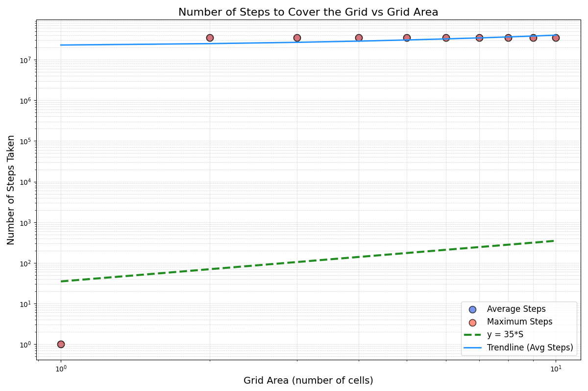

# Snake Grid Coverage with Dynamic Prime Step Algorithm

## Introduction

The goal of this project is to find an efficient way to traverse a grid and cover all the cells using a snake-like algorithm. The performance metric used is the number of moves (steps) it takes to visit all cells of the grid. We simulate the movement of the snake across different grid sizes and evaluate its performance. 

### **Initial Idea: Spiral Traversal**

The first approach I considered was a **naive spiral traversal**. In this approach, the snake would move in a simple spiral pattern: moving right, down, left, up, and repeating the sequence. 

- **Pros**: This works well for smaller grids, particularly for square grids.
- **Cons**: For very narrow grids (like 1xS or Sx1), the spiral method breaks down and becomes inefficient. On such grids, the snake tends to move in circles or repeatedly revisits cells, leading to high step counts.

### **Prime Number Movement**

To improve the efficiency of the traversal, I decided to use **prime numbers** for movement. The idea behind using primes was to reduce the chance of revisiting the same cells too often. By selecting prime numbers as steps for rightward and downward movements, we avoid the snake visiting the same cells consecutively.

I generated the first 200 prime numbers and used them as step sizes for the movement of the snake. The snake would move right for a prime number of steps, and then move down for one step. By limiting the directions to right and down, we simplify the traversal pattern. 

- **Pros**: This method performs well for very large or very small grids.
- **Cons**: It’s not very optimal for grids that fall in between these extremes. The prime numbers work better for very large grids or very small grids, but might not be ideal for mid-sized grids.

\


### **Dynamic Prime Step Adjustment**

After evaluating the previous approaches, I concluded that the best approach would involve a **dynamic adjustment of step sizes**. Specifically, I designed a mechanism where the snake would "reset" its prime movement step after traversing a certain number of cells. This allows the snake to cycle through prime numbers in a way that adapts to the grid's size.

The idea is to cycle through primes in such a way that the step size adapts dynamically to the grid’s dimensions, ensuring efficient traversal across both small and large grids.

Here are some of my best results:

\


# Grid Coverage Strategy Testing
## Overview of Testing

The testing framework evaluates the ability of the snake's movement strategy to cover grid areas efficiently. It simulates movements based on the commands in `file.txt` and measures coverage across varying grid sizes.

## Key Components of Testing

### Command Reading  
Movement commands are read from `file.txt`. Each command specifies a directional move:
- `R` for moving one step to the right.
- `D` for moving one step downward.

### Grid Simulation  
The grid simulation models the snake's traversal on a rectangular grid.  
- **Start Position**: The simulation begins at the top-left corner `(0, 0)`.  
- **Wraparound Behavior**: If the snake reaches a grid boundary, it wraps around to the opposite side (toroidal grid behavior).  
- **Visited Cells**: A set tracks all unique grid cells visited during the simulation.

### Performance Metrics  
The testing framework evaluates performance for different grid areas using the following metrics:  
- **Average Steps**: The mean number of steps required to cover the entire grid across multiple tests.  
- **Maximum Steps**: The longest observed sequence of steps before full grid coverage.  
- **Efficiency Bound**: A theoretical limit of `35 × S` steps, where `S` is the grid area. This serves as a benchmark for evaluating strategy performance.

## Testing Workflow

1. **Area Generation**:  
   A range of grid areas is defined (e.g., from 10 to 1000). The areas are split into intervals, and grid dimensions are dynamically chosen to represent different aspect ratios.  

2. **Simulation Execution**:  
   For each grid area:
   - A set number of tests are conducted.
   - Grid dimensions (width and height) are generated randomly, ensuring balanced ratios.
   - The strategy is evaluated for coverage and step efficiency.

3. **Performance Recording**:  
   For each grid area, the framework records:  
   - The average number of steps across all tests.  
   - The maximum number of steps required in the worst-case scenario.

4. **Visualization**:  
   Results are plotted to compare:  
   - Average steps.  
   - Maximum steps.  
   - The theoretical `35 × S` limit.

## Performance Visualization

The performance is visualized using a scatter plot and trendlines:
- **Average Steps**: Represented by blue points on the graph.
- **Maximum Steps**: Represented by red points.
- **Efficiency Bound**: Shown as a green dashed line (`y = 35 × S`).

### Example Plot
- **X-axis**: Grid area (number of cells).  
- **Y-axis**: Number of steps taken.  
- Logarithmic scales are optionally used for better representation of large ranges.

## How to Run the Test

1. Generate the movement commands in `file.txt` using the desired strategy.  

```python
python3 generate.py
```

2. Execute the test framework:
   - Input the range of grid areas and the number of tests per area.

```python
python3 testing.py
```

3. Review the printed performance summary and the saved plot (`performance_plot.png`).

## Interpretation of Results

- **Good Performance**: If the average steps are consistently below the `35 × S` threshold, the strategy is efficient.  
- **Areas for Improvement**: Large deviations in average or maximum steps from the efficiency bound indicate suboptimal movement patterns.

## Conclusion

The implemented solution leverages the following key principles to optimize grid traversal:

Co-Prime Steps: Prime numbers are used for movement steps to ensure a high likelihood that the step size is co-prime with the grid dimensions. This reduces the probability of revisiting the same cell multiple times, thereby maximizing efficiency.

Coverage Efficiency: Co-prime step sizes create a traversal pattern that uniformly covers the grid. This minimizes overlaps and ensures that cells are visited in an optimal sequence, even on grids with unusual dimensions.

Adaptive Step Sizes: By dynamically adjusting the range of primes based on the current command index, the algorithm adapts to the grid's scale. Smaller steps are used for smaller grids to ensure precision, while larger steps are employed for larger grids to maintain efficiency. This adaptability ensures that the number of moves remains proportional to the grid size, regardless of its dimensions.

This combination of co-prime logic, efficient coverage, and adaptability makes the solution robust across a wide range of scenarios, balancing theoretical soundness with practical performance.
